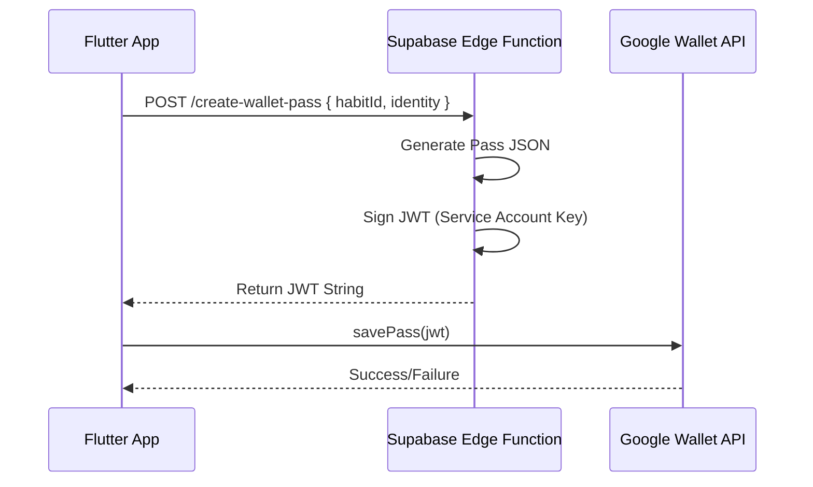

# WALLET_INTEGRATION_SPEC.md

> **Status:** DRAFT (v1.0.0)  
> **Feature:** "The Pocket Totem" (Google Wallet Identity Card)  
> **Phase:** 25.8  
> **Owner:** Engineering Team

---

## 1. Overview

The **Pact Identity Card** is a digital artifact that lives in the user's Google Wallet. It serves as a permanent, tangible anchor for their new identity (e.g., "The Runner", "The Writer").

**Value Proposition:**
- **Tangibility:** Turns an abstract habit into a "License".
- **Visibility:** Lock screen notifications via Geofencing.
- **Status:** A shareable, high-status flex.

---

## 2. Architecture

We use a **Backend-Signed JWT** approach to ensure security and prevent spoofing.



---

## 3. Data Model (Generic Pass)

We use the `GenericPass` type from Google Wallet API.

**Fields:**
- **Header:** "THE PACT" (Logo)
- **Title:** User's Identity (e.g., "RUNNER'S LICENSE")
- **Subheader:** "Active Pact"
- **Hero Image:** The Wax Seal (Gold for >7 day streak, Red for <7)
- **Barcode:** QR Code linking to `thepact.co/verify/{id}`
- **Details:**
  - "Habit": "Run 5k"
  - "Time": "7:00 AM"
  - "Streak": "12 Days" (Dynamic)

---

## 4. Implementation Steps

### Step 1: Google Cloud Setup
1. Create Project in Google Pay & Wallet Console.
2. Create "Issuer Account".
3. Create Service Account in Google Cloud Console.
4. Grant Service Account access to Wallet Issuer account.
5. Download `service-account.json` key.

### Step 2: Supabase Edge Function (`create-wallet-pass`)

**Path:** `supabase/functions/create-wallet-pass/index.ts`

**Dependencies:**
- `googleapis` (for auth)
- `jsonwebtoken` (for signing)

**Logic:**
```typescript
import { serve } from "https://deno.land/std@0.168.0/http/server.ts"
import { create, getNumericDate } from "https://deno.land/x/djwt@v2.8/mod.ts"

serve(async (req) => {
  const { habitId, identity, streak } = await req.json()
  
  // 1. Define Pass Object
  const passObject = {
    iss: "service-account-email@...",
    aud: "google",
    typ: "savetowallet",
    payload: {
      genericObjects: [{
        id: `issuer_id.${habitId}`,
        classId: `issuer_id.pact_identity_card`,
        logo: {
          sourceUri: { uri: "https://thepact.co/logo.png" }
        },
        cardTitle: {
          defaultValue: { language: "en", value: identity }
        },
        subheader: {
          defaultValue: { language: "en", value: "PACT IDENTITY CARD" }
        },
        header: {
          defaultValue: { language: "en", value: `${streak} DAY STREAK` }
        }
      }]
    }
  }

  // 2. Sign JWT
  const key = await importKey(Deno.env.get("GOOGLE_SERVICE_ACCOUNT_KEY"))
  const jwt = await create({ alg: "RS256", typ: "JWT" }, passObject, key)

  return new Response(JSON.stringify({ jwt }), { headers: { "Content-Type": "application/json" } })
})
```

### Step 3: Flutter Integration

**Package:** `add_to_google_wallet: ^0.1.0`

**Code:**
```dart
class WalletService {
  final _uuid = Uuid();

  Future<void> addToWallet(Habit habit) async {
    // 1. Get JWT from Backend
    final response = await supabase.functions.invoke('create-wallet-pass', body: {
      'habitId': habit.id,
      'identity': habit.identity,
      'streak': habit.streak,
    });
    
    final jwt = response.data['jwt'];

    // 2. Launch Native Wallet Screen
    final walletPlugin = AddToGoogleWallet();
    await walletPlugin.savePass(pass: jwt);
  }
}
```

---

## 5. Dynamic Updates

To update the streak on the card without re-issuing:
1. Backend runs a cron job (or triggers on habit completion).
2. Calls Google Wallet REST API (`PATCH /genericObject/{id}`).
3. Updates `header.defaultValue.value` to new streak count.
4. User sees update via push notification from Wallet app.

---

## 6. Geofencing (The "Flex")

We add `locations` to the Pass Object:

```json
"locations": [
  {
    "kind": "walletobjects#latLongPoint",
    "latitude": 37.422,
    "longitude": -122.084
  }
]
```

When user enters this radius (e.g., Gym), the card appears on Lock Screen.

---

**End of Spec.**
